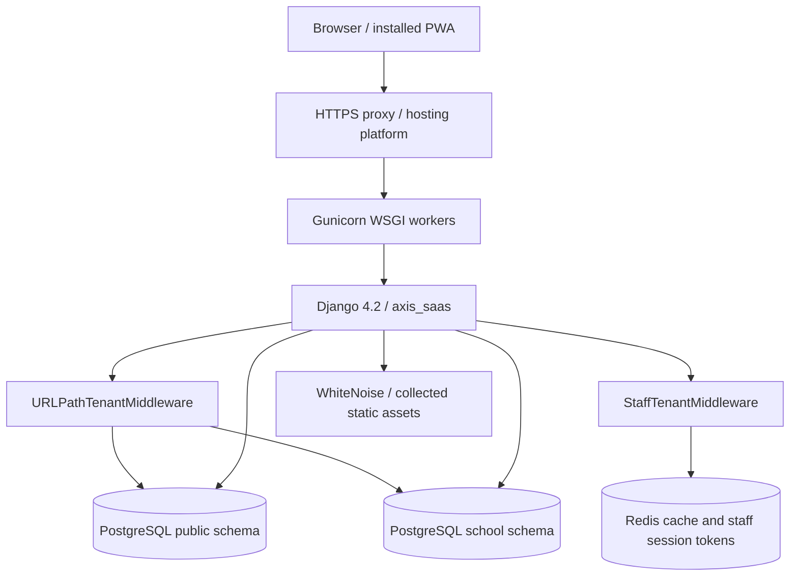
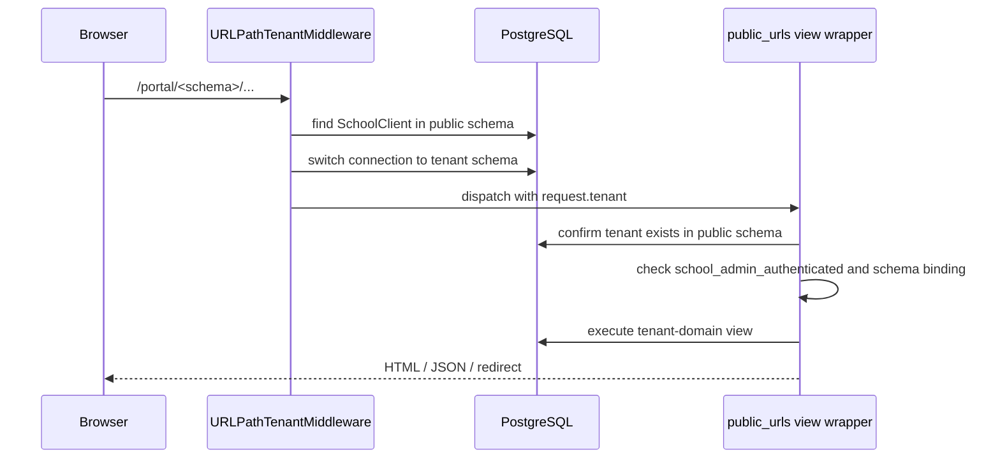

# AXIS Architecture

## Runtime components

AXIS is a server-rendered Django application. `manage.py` selects `axis_saas.settings`; WSGI and ASGI entry points are `axis_saas.wsgi` and `axis_saas.asgi`. Installed application and middleware setup, database routing, static/media roots, cache, authentication redirects, and deployment security switches are configured in `axis_saas/settings.py`.

The primary web entry point is `axis_saas.public_urls`. That module owns the root, admin, tenant portal, global utility API, tenant APIs, and staff portal include. `axis_saas.staff_urls` is included at `/portal/staff/`. The `/portal/<schema_name>/` segment chooses a school schema. `axis_saas.tenant_urls` is configured as `TENANT_URLCONF`, but the current path middleware does not switch URLconf to it; its 25-line route list is a small legacy subset, not the complete route source.

## Schema ownership and tenant boundary

AXIS uses PostgreSQL schema tenancy through `django-tenants` and `django_tenants.postgresql_backend`.

| Scope | Typical contents | How code reaches it |
|---|---|---|
| `public` | `SchoolClient`, domains, Django shared/auth/session tables, staff credential registry, biometric credential registry | Tenant lookup and cross-tenant authentication execute with public schema context. |
| `<school schema>` | Students, fee records/payments, classes, staff profiles, attendance, leave, timetables, stock, notifications, and feature data | Portal request middleware calls `connection.set_tenant()` before view dispatch. |

`axis_saas` appears in both `SHARED_APPS` and `TENANT_APPS`. Models from the app can therefore be represented in both migration scopes, while code deliberately treats the tenant registry and credential registries as public-schema data. Always inspect the active `connection.schema_name` and use `schema_context()` when crossing that boundary. Avoid using a model in a presumed schema without checking the call path.

Schema isolation is the principal data boundary; IDs may repeat across schemas. Cross-schema registry rows such as `StaffCredential.staff_id` and `StaffBiometricCredential.staff_id` are integer references plus schema name, not cross-schema database foreign keys.

## Tenant request lifecycle

`URLPathTenantMiddleware` acts only on paths beginning `/portal/`. It extracts segment 2, looks up the tenant while on the public schema, sets `request.tenant`, and switches the connection to the tenant. A missing registry row keeps the connection public and sets `request.missing_tenant_schema`; it does not provision a tenant. Non-portal paths set `request.tenant = None` and remain on public schema. Template context uses `DummyTenant` to make public rendering safe.

Most tenant-admin routes are wrapped by `portal_wrapper(login_required_for_schema(...))`. The outer wrapper re-fetches the tenant from public schema, returns 404 for an unknown schema and populates `request.tenant`; the inner wrapper requires `school_admin_authenticated` and an exact `school_admin_schema` match. The path parameter is a slug, with one regex route allowing alphanumeric, underscore, and hyphen schema names for fee collection.

## Authentication and sessions

### School administrator

The school portal login is `/portal/<schema>/login/`. `school_login` fetches the tenant from public schema and checks `admin_username` plus `SchoolClient.check_password()`. Passwords are hashed with Django `make_password`; `check_password` retains compatibility with stored legacy plaintext. Successful login flushes the session, stores `school_admin_authenticated`, `school_admin_schema`, and `school_admin_username`, and removes staff-session keys. Logout flushes the shared session. These are custom school-admin credentials, not Django `User` authentication.

`get_school_default_route()` sends a tenant to the first enabled feature in this order: dashboard, students, fee collection, defaulters, reports, stock, fee structure, fee settings, family payment; otherwise settings. It returns dashboard for non-school/legacy tenant types.

`signals.py` provisions a tenant Django superuser after schema sync only when `_raw_password` is available, and synchronizes an existing tenant superuser password when the registry password is changed with a raw value. Do not assume this happens for every update; warnings are logged if the raw password is unavailable.

### Staff

Staff sign-in is a separate user experience at `/portal/staff/login/`. `StaffCredential` lives in public schema and points to a tenant staff row via `(schema_name, staff_id)`. Login state carries the tenant and staff IDs plus a rotating session token. `StaffTenantMiddleware` validates the cached `staff_session_token:<schema>:<staff>` for protected staff URLs, rejects missing/mismatched/logged-out tokens, resolves the tenant, switches schemas, and resolves an active staff record in production. Staff logout/forced logout invalidates session tokens and cached session keys.

Biometric/passkey (WebAuthn) registrations are kept in public schema in `StaffBiometricCredential`; per-staff `Staff.biometric_login_enabled` controls whether setup is required. The staff middleware intentionally leaves a short allowlist public: login/logout, biometric setup/authentication endpoints, manifest, service worker, and offline page. The staff PWA service worker avoids caching per-user `/portal/staff/` responses.

Important code behavior: token validation is enforced independently of `DEBUG`, but staff record lookup differs in debug mode; debug mode may synthesize a developer staff object if a referenced staff row is missing. Do not treat debug behavior as production authorization.

## Middleware order

Configured order in settings:

1. Django security middleware.
2. WhiteNoise static middleware.
3. Django session middleware (sessions are stored in public schema by custom backend).
4. `URLPathTenantMiddleware`.
5. `StaffTenantMiddleware`.
6. Common, CSRF, Django authentication, messages, clickjacking middleware.

The staff middleware runs after URL tenant routing and may set the staff request's tenant/schema from the validated staff session. When changing middleware order, test both school-admin and staff paths, schema switching, CSRF, and session persistence.

## Views, templates, and browser behavior

Views are divided by feature under `axis_saas/views/`; `axis_saas/views/__init__.py` re-exports them, while `axis_saas/views.py` is a compatibility re-export. The portal is primarily rendered from `templates/tenant/`, with mobile variants in `templates/mobile/` and staff pages in `templates/staff/` / `templates/mobile/staff/`. Django Admin has one custom action template.

Browser assets include feature-flag visibility (`static/js/school_client_features.js`), biometric flows (`static/js/staff_biometric.js`), offline student sync (`axis_saas/static/js/offline_student.js`), an admin/root PWA service worker (`static/sw.js` served by `axis_saas.pwa_views`), and a staff-scoped PWA (`axis_saas.views.staff_pwa`). The two service workers have different scopes and cache rules; keep staff session data out of shared caches.

## Persistence, cache, and signals

PostgreSQL is authoritative. Redis is configured as Django's default cache; uses include feature/dashboard/stat caches, leave working-day caches, staff session tokens, online indicators, and lazy-attendance locks. If Redis is unavailable, several call paths degrade to a cache miss or skip non-critical work, but staff session validation fails closed when the token cannot be confirmed.

`axis_saas.apps.AxisSaasConfig.ready()` imports `signals.py`. Signal effects include tenant superuser provisioning/password synchronization, invalidation of dashboard/defaulter/student/voucher caches, after-commit timetable reconciliation and removal of orphaned period-teacher assignments, leave-to-attendance synchronization, and working-day cache invalidation after weekly-holiday changes. Signals may run from admin, shell, management command, or view writes; keep them idempotent and schema-aware.

## Active vs compatibility surfaces

- Active root URLconf: `axis_saas/public_urls.py`.
- Staff URLconf: `axis_saas/staff_urls.py`, included by the root URLconf.
- `axis_saas/tenant_urls.py`: configured tenant URLconf but not the current main route table.
- `axis_saas/urls.py`: tiny secondary URL list, not selected by settings.
- `axis_saas/views.py`: generated package re-export; active imports resolve to `axis_saas/views/`.
- `staff_portal_leave_managemetn.py`: misspelled compatibility shim; active import uses correctly spelled `staff_portal_leave_management.py`.
- `.bak*`, `.bak_dup`, and `.backup*`: checked-in historical snapshots, not automatically loaded.
