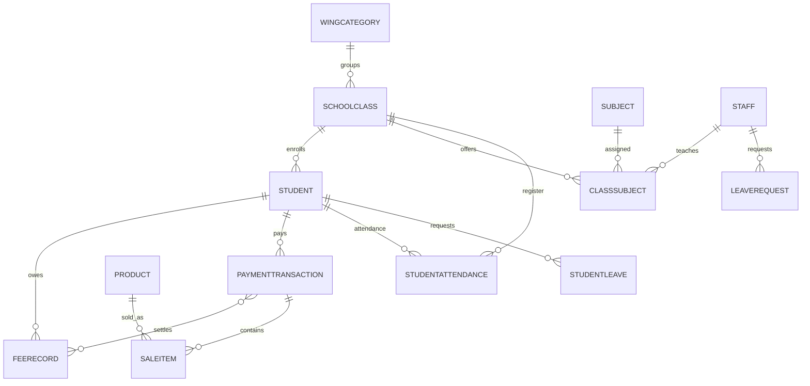

# AXIS Data Model

All names below are Django model classes from `axis_saas.models`, unless marked as biometric. Tenant business rows are accessed after selecting the school schema. Registry and cross-tenant credential records are deliberately queried in public schema. See [Architecture](architecture.md) for schema rules.

## Public registry and identity

| Model | Scope / purpose | Important fields and relations |
|---|---|---|
| `SchoolClient` | Public tenant registry (`TenantMixin`) | `schema_name` inherited from django-tenants; unique name, active flag, admin username/password, logo, tenant type, JSON enabled features; `auto_create_schema=True`. Hashes new admin passwords and checks hashes or legacy plaintext. |
| `SchoolDomain` | Public host/domain registry (`DomainMixin`) | Inherited domain-to-tenant mapping. Path-based middleware currently chooses tenants by schema name rather than hostname. |
| `StaffCredential` | Public staff login registry | Unique username, hashed password, staff ID + schema name, active/lockout/failure state, last login; max five failures locks for 15 minutes. Integer staff ID is not a cross-schema FK. |
| `StaffBiometricCredential` (`biometric_models.py`) | Public WebAuthn credential registry | Staff ID + schema, unique credential ID, public key, sign counter, enabled state. Stores URL-safe base64 values and exposes byte-decoding properties. |

## School, students, and fees

| Model | Purpose | Important fields and relations |
|---|---|---|
| `WingCategory` | Optional campus/wing hierarchy | Self-parent FK, active flag, parent/name uniqueness. Classes/students may reference a category. |
| `Student` | Student profile | Name/guardian CNIC/mobile, grade/section, admission/status/gender/DOB/address/photo/notes, unique roll number, custom fee, default extras, automation flag; optional `SchoolClass` and `WingCategory` FKs. Creation derives grade fee and allocates roll number. |
| `FeeStructure` | Grade fee defaults | Unique grade, monthly fee, updated timestamp. Saving updates `custom_fee` for all existing students in that grade (including explicit overrides); note this broad side effect when editing a structure. |
| `FeeRecord` | Monthly student obligation | Student FK; month/year unique per student; amount, paid amount, due date and offset, late-fee rate/accrual, status, remarks, JSON extras. Properties calculate `remaining`, `total_amount`, `remaining_total`, `is_fully_paid`; save recalculates status. |
| `PaymentTransaction` | Payment/receipt | Student FK, M2M fee records, amount/date/mode/type, unique generated receipt number, remarks/extras/creator. Modes: cash, bank transfer, cheque, online. |
| `SaleItem` | Product line on a payment | Payment FK, nullable product FK, denormalized name, quantity/unit/line total and timestamp. |
| `SchoolFeeSettings` | Tenant fee automation defaults | Generation day, due offset, late fee percentage, default extra charges, automation toggle and timestamps. Intended as one tenant settings record by application convention. |
| `ManualGenerationLog` | Fee-generation audit/summary | Month/year, created/skipped counts, time, trigger identity and `manual`/`auto` type. |

`FeeRecord` enforces one `(student, month, year)` row. `total_amount` is principal plus each extra charge and accrued late fee. `remaining_total <= 0` means paid; otherwise positive `paid_amount` means partial; otherwise a past due date means overdue, else pending. This status logic and payment reconciliation are central invariants.

## Inventory, notifications, staff, and leave

| Model | Purpose | Important fields and relations |
|---|---|---|
| `ProductCategory` | Inventory category | Unique name and optional description. |
| `Product` | Inventory item | Category FK, name, unique optional generated SKU, selling price, quantity, notes, timestamps. |
| `Notification` | Tenant portal notification | Message/link, read flag, timestamp, JSON extra data; newest first. |
| `Staff` | Tenant staff profile | Generated staff ID/full name, names/contact/role/department/job, active state, can-mark-attendance/can-view-fees flags, biometric-login toggle, photo and timestamps. Creates/maintains a public `StaffCredential`; class/subject/attendance relations point back to staff. |
| `LeavePolicy` | Tenant singleton for staff leave | Unique `is_singleton`; monthly/weekly/consecutive caps, backdating, approved-only counting, rejection/suspension rules, working-day policy. Use `LeavePolicy.current()`. |
| `LeaveRequest` | Staff leave request | Staff FK, type/title/reason/date span/day count/status, reviewer metadata and admin remarks. |
| `LeaveSuspension` | Staff leave application suspension | Staff FK, date span/active state, automatic/manual source, creator and lift metadata. Null end date means indefinite until lifted. |
| `StudentLeave` | Student leave application | Student FK, type/title/reason/date span/day count/status, applicant/reviewer metadata. Approved rows trigger attendance backfill. |

## Classes, subjects, and calendars

| Model | Purpose | Important fields and relations |
|---|---|---|
| `SchoolClass` | Class and section | Name/section/description, optional class-teacher and wing FKs, active flag. Normalizes class/section and checks case-insensitive uniqueness within a wing. |
| `Subject` | Subject catalogue | Name/code/description/active; normalized title-case name and generated code; case-insensitive name check. |
| `ClassSubject` | Subject assignment to class | Class and subject FKs, optional teacher FK, academic year, active flag; unique class/subject pair. |
| `AcademicCalendar` | Tenant academic calendar | Working-day JSON, school start/end, period duration; `get_calendar()` gets or creates primary row (`pk=1`). |
| `Holiday` | One-off/annual-date holiday | Date/name/recurring flag. |
| `WeeklyHoliday` | Weekly recurring holiday | Unique weekday and label. Saving/deleting invalidates cached working-day sets. |
| `AnnualHoliday` | Annual recurring month/day holiday | Month/day/label, unique month/day. |
| `Vacation` | Date-range holiday | Name, start/end and description. |

## Timetable and teacher assignments

| Model | Purpose | Important fields and constraints |
|---|---|---|
| `Period` | Period on an academic calendar | Order, start/end/name, calendar FK; unique order per calendar. |
| `TimetableEntry` | Legacy/regular weekly timetable slot | Class/day/period/subject/teacher/academic year; one class/day/period slot. |
| `DaySchedule` | Day/label timetable definition | Calendar, weekday/order, `ScheduleLabel` FK (`PROTECT`), start/end, period count/duration, active/break settings, optimistic-lock timestamp; unique label/calendar/day. |
| `ScheduleLabel` | Reusable schedule grouping label | Unique name/description/timestamps; case-insensitive DB unique constraint. |
| `PeriodsTimetable` | Persisted timetable template | Title, protected `ScheduleLabel` FK, break duration, JSON days payload, timestamps. |
| `ClassTimetableAssignment` | Timetable-to-class relation | Class and timetable FKs; same pair unique; multiple timetables per class allowed. The shared-label rule is checked in assignment view logic. |
| `PeriodTeacherAssignment` | Teacher and subject per class/day/period | Class/day/order, optional subject/teacher FKs, created/updated-by and timestamps; unique class/day/order. |
| `SubstituteAssignment` | Date-specific cover | Absent/substitute staff, class, optional subject, day/period/date/reason/creator; unique class/day/period/date. Does not alter the base assignment. |

## Attendance and audit

| Model | Purpose | Important fields and constraints |
|---|---|---|
| `StudentAttendance` | Full-day or per-period student attendance | Student/class/date, nullable period order/timetable, status/source, original teacher and v2 marked/modified staff metadata, remarks/timestamps. Unique student/date/period; separate conditional uniqueness for full-day null period. |
| `StaffAttendance` | Daily staff attendance/check in/out | Staff/date unique, check-in/out, status, late/worked minutes, marker, source, remarks. |
| `AttendanceAuditLog` | Student attendance change history | Nullable attendance FK plus student/date/period snapshots, action, old/new status, actor/name/time/reason. Snapshots preserve context when attendance is deleted. |
| `AttendancePolicy` | Tenant singleton attendance policy | Unique singleton flag, mode (daily/period-wise/both), late threshold, low-attendance percentage, automatic absent time, notifications, teacher backdating/approval rules. Use `AttendancePolicy.current()`. |
| `ClassTeacherAttendancePermission` | Per-class teacher attendance permission | One-to-one class relation; backdate mode, max edits per date, view/edit history windows, updated-by metadata. `for_class()` lazily creates defaults. |
| `ClassTeacherEditQuota` | Teacher edit counter per class/date | Class/date unique, count and last edit metadata. Admin edits do not consume this quota. |

## Relationship sketch

The diagram omits secondary timetable, audit, permission, and tenant-registry edges; model declarations are authoritative.

## Persistence and migration guidance

Migrations `0001` through `0036` are in `axis_saas/migrations/`. The sequence includes tenant/schema repair, wing/class uniqueness, biometric credentials, academic timetable and schedule-label refactors, staff leave/suspensions, attendance production hardening, edit permissions, and multi-timetable assignments. Read the migration dependency and data migration before editing a model; migrations run in both shared and tenant contexts according to django-tenants.

`structure.sql` and `data.sql` are large checked-in SQL artifacts, not Django migration source. `staticfiles/` is collected output. Do not edit either to make routine model changes; use migrations and ORM code, then follow [Operations](operations.md).
